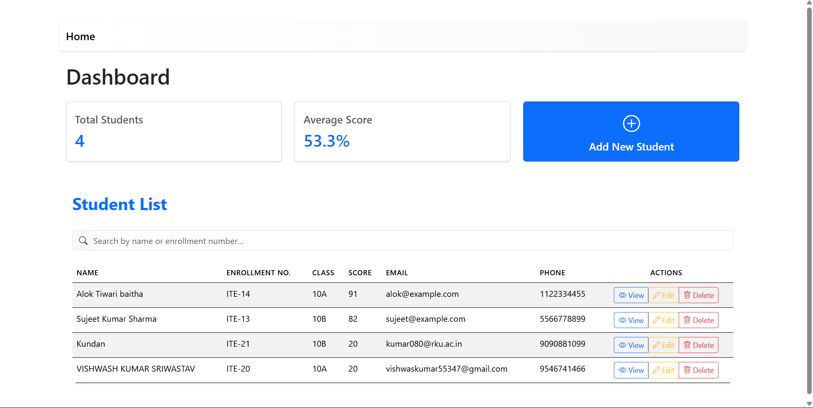

# React Student Management Dashboard

A frontend mini-project built with React demonstrating core concepts for managing student data. This application features a dashboard overview, a detailed student list with CRUD actions, and search functionality, all operating on client-side mock data.

## Screenshot




## Key Features

*   **Dashboard Overview:** Displays key statistics at a glance:
    *   Total Number of Students
    *   Average Student Score
*   **Student List:** Presents registered students in a clear table format including:
    *   Name
    *   Enrollment No.
    *   Class
    *   Score
    *   Email *(New)*
    *   Phone *(New)*
*   **CRUD Operations:**
    *   **Add:** Prominent button on the dashboard to navigate to the add student form.
    *   **View:** Button on each row to view detailed student information (functionality might be pending). *(New)*
    *   **Edit:** Button on each row to modify student details.
    *   **Delete:** Button on each row to remove a student record (with confirmation).
*   **Search Functionality:** Input field to filter the student list by name or enrollment number (frontend filtering logic might be pending). *(New)*
*   **Client-Side Routing:** Uses React Router for navigation between different views (Home/Dashboard, Add Form, Edit Form).
*   **Responsive Design:** Styled with Bootstrap for usability across different screen sizes.

## Technologies Used

*   **Frontend Library:** [React.js](https://reactjs.org/) (v18+)
    *   Functional Components & Hooks (`useState`, `useEffect`, `useMemo`, `useCallback`)
*   **Routing:** [React Router DOM](https://reactrouter.com/) (v6+)
*   **Styling:** [Bootstrap](https://getbootstrap.com/) (v5+)
*   **Build Tool / Dev Server:** [Vite](https://vitejs.dev/)
*   **Language:** JavaScript (ES6+)
*   **Data:** Mock data stored in a local JavaScript array (no backend connection).


## Setup and Installation

1.  **Prerequisites:** Make sure you have [Node.js](https://nodejs.org/) (version 16 or later recommended) installed, which includes npm.
2.  **Clone the repository:**
    ```bash
    git clone <your-repository-url>
    cd student-management-mini
    ```
    *(Replace `<your-repository-url>` with your actual repository URL)*
3.  **Install dependencies:**
    ```bash
    npm install
    ```
4.  **Start the development server:**
    ```bash
    npm run dev
    ```
5.  **Open the application:**
    Navigate to `http://localhost:5173` (or the address provided by Vite) in your browser.

## Usage

*   The **Home** page (`/`) serves as the main Dashboard, displaying summary statistics and the student list.
*   Use the **Search bar** above the list to filter students by name or enrollment number.
*   Click the large **"Add New Student"** button on the dashboard to navigate to the form for adding students.
*   In the **Student List** table:
    *   Click **"View"** to see more details about a specific student (if implemented).
    *   Click **"Edit"** to modify a student's information.
    *   Click **"Delete"** to remove a student from the system.

## Future Improvements / Roadmap

*   Implement backend logic for Search/Filtering.
*   Implement the "View Student Details" page/modal.
*   Connect to a real backend API (e.g., Node.js/Express, Python/Django) and database (e.g., PostgreSQL, MongoDB).
*   Add user authentication (Login/Registration).
*   Implement role-based access control.
*   Add pagination for the student list.
*   Enhance form validation.
*   Add sorting capabilities to the student table.

---

This README reflects the features visible in your latest screenshot. Remember to update the screenshot path!
IGNORE_WHEN_COPYING_START
content_copy
download
Use code with caution.
IGNORE_WHEN_COPYING_END)


## Key Features

*   **Dashboard Overview:** Displays key statistics at a glance:
    *   Total Number of Students
    *   Average Student Score
*   **Student List:** Presents registered students in a clear table format including:
    *   Name
    *   Enrollment No.
    *   Class
    *   Score
    *   Email *(New)*
    *   Phone *(New)*
*   **CRUD Operations:**
    *   **Add:** Prominent button on the dashboard to navigate to the add student form.
    *   **View:** Button on each row to view detailed student information (functionality might be pending). *(New)*
    *   **Edit:** Button on each row to modify student details.
    *   **Delete:** Button on each row to remove a student record (with confirmation).
*   **Search Functionality:** Input field to filter the student list by name or enrollment number (frontend filtering logic might be pending). *(New)*
*   **Client-Side Routing:** Uses React Router for navigation between different views (Home/Dashboard, Add Form, Edit Form).
*   **Responsive Design:** Styled with Bootstrap for usability across different screen sizes.

## Technologies Used

*   **Frontend Library:** [React.js](https://reactjs.org/) (v18+)
    *   Functional Components & Hooks (`useState`, `useEffect`, `useMemo`, `useCallback`)
*   **Routing:** [React Router DOM](https://reactrouter.com/) (v6+)
*   **Styling:** [Bootstrap](https://getbootstrap.com/) (v5+)
*   **Build Tool / Dev Server:** [Vite](https://vitejs.dev/)
*   **Language:** JavaScript (ES6+)
*   **Data:** Mock data stored in a local JavaScript array (no backend connection).

## Project Structure


student-management-mini/
├── public/ # Static assets
├── src/
│ ├── components/ # Reusable UI (StudentList, StudentForm, StatCard, etc.)
│ ├── data/ # Mock data definition
│ ├── pages/ # Page components (HomePage, AddStudentPage, etc.)
│ ├── App.jsx # Main application: Routing, state management
│ ├── index.css # Global styles
│ └── main.jsx # Application entry point
├── .gitignore
├── index.html
├── package.json
├── vite.config.js
└── README.md # This file

## Setup and Installation

1.  **Prerequisites:** Make sure you have [Node.js](https://nodejs.org/) (version 16 or later recommended) installed, which includes npm.
2.  **Clone the repository:**
    ```bash
    git clone <your-repository-url>
    cd student-management-mini
    ```
    *(Replace `<your-repository-url>` with your actual repository URL)*
3.  **Install dependencies:**
    ```bash
    npm install
    ```
4.  **Start the development server:**
    ```bash
    npm run dev
    ```
5.  **Open the application:**
    Navigate to `http://localhost:5173` (or the address provided by Vite) in your browser.

## Usage

*   The **Home** page (`/`) serves as the main Dashboard, displaying summary statistics and the student list.
*   Use the **Search bar** above the list to filter students by name or enrollment number.
*   Click the large **"Add New Student"** button on the dashboard to navigate to the form for adding students.
*   In the **Student List** table:
    *   Click **"View"** to see more details about a specific student (if implemented).
    *   Click **"Edit"** to modify a student's information.
    *   Click **"Delete"** to remove a student from the system.

## Future Improvements / Roadmap

*   Implement backend logic for Search/Filtering.
*   Implement the "View Student Details" page/modal.
*   Connect to a real backend API (e.g., Node.js/Express, Python/Django) and database (e.g., PostgreSQL, MongoDB).
*   Add user authentication (Login/Registration).
*   Implement role-based access control.
*   Add pagination for the student list.
*   Enhance form validation.
*   Add sorting capabilities to the student table.

---

